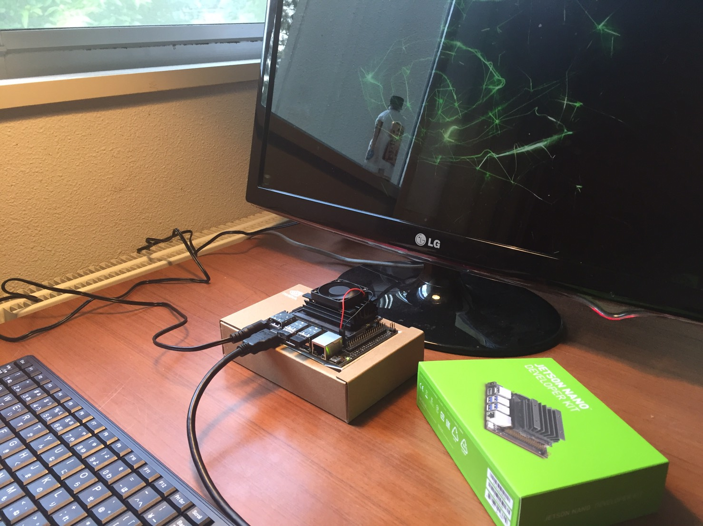

# July 21
Witer : [waarrk](https://twitter.com/waarrk)

## I made a Git diary
### How to
1. Make repository with README
2. Write easy explanation in README
3. Make diary.md
4. Make contents directory
5. Make content in the directory
6. Link them with a link
7. Let's write text !!

## I powered on Jetson nano
Jetson nano is our main board in Yurubot.  
I referred to the [official site](https://developer.nvidia.com/embedded/learn/get-started-jetson-nano-devkit#intro).

It is a shop where we bought it.
* Jetson nano [Buy in Akizuki Denshi Tushyo](http://akizukidenshi.com/catalog/g/gM-14393/)
* 5V 4A Power Cable [Buy in Akizuki Denshi Tushyo](http://akizukidenshi.com/catalog/g/gM-06238/)
* Fan [Buy in Amazon](https://www.amazon.co.jp/gp/product/B07SDGLZ1H/ref=ppx_yo_dt_b_asin_title_o03_s00?ie=UTF8&psc=1)
* Micro SD (I bought it in Akiba !!!!)

※Jetson nano can move 5V2A with micro-usb  
but if you are want to use it more high power,  
it needs 5V4A. Jetson nano has DC conecter, 2.1ｘ5.5ｘ9.5(mm) center plus.  
If you use it, please connect J48 jamper pin.  

## Connect jetson nano to Wifi
Jetson nano has not wifi system so make it usable to development.
### How to
1. buy USB-wifi adapter ([This is mine](https://www.logitec.co.jp/products/wlan/lanw300anu2/index.php))
2. Connect adapter to USB
3. Choose SSID  

My adapter is not need usb driver install so It was usable immediately by connecting.

  
  
That's all thank you.
