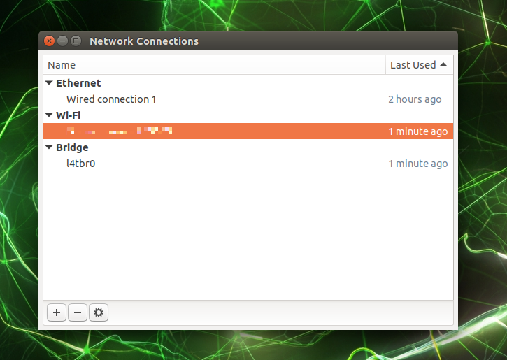
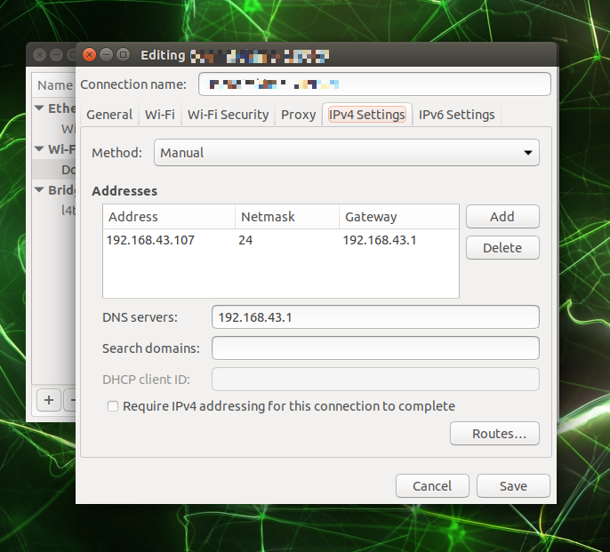
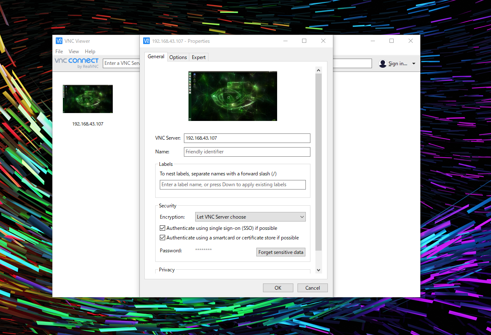
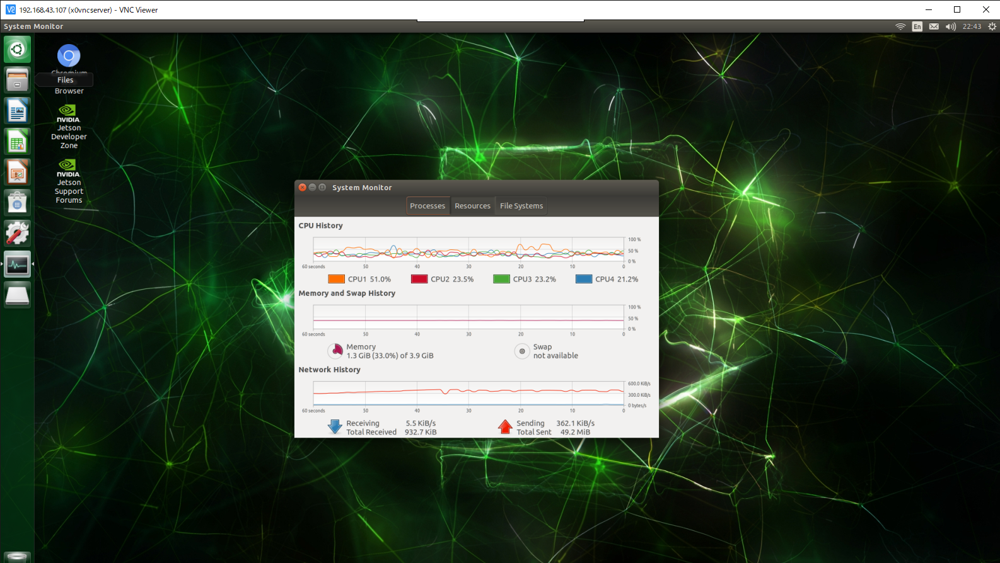

# July 22
Witer : [waarrk](https://twitter.com/waarrk)

## Setting fixed ip address
In initial setting, Jetson nano's ip adress is not fixed.  
But that is not convenient because it is used by ssh and vnc connection.  
So I fixed it.
### How to
1. Open Network Connections Setting  
2. Click gear icon  
3. When open new window, please open IPv4 Settings tab  
4. Change to manual  
5. Please set Adress, Netmask, Gateway, and DNS Server  



## Install VNC Server on Jetson Nano
VNC stands for Virtual Network Computing.  
If set it, I can remote control Jetson Nano from My PC.  
I can use GUI and My PC's mouse and keyboard.  
### How to
First, plese install TigerVNC.  
```
sudo apt update
sudo apt install tigervnc-standalone-server
sudo apt install tigervnc-scraping-server
```
Second, plese make password.  
This password is need to remote control.  
```
tigervncpasswd
```
Third, connection test.  
Plese run this command. VNC server will be Activate.  
```
x0vncserver -display :0 -passwordfile ~/.vnc/passwd
```

## VNC Connection from Windows PC
Please install VNC Viewer from this site and setting up.  
https://www.realvnc.com/en/connect/download/viewer/  

File -> New connection  


Please write Jetson Nano's ip in text box.  
example)192.168.43.1  
Next, click OK button and connection VNC.  
If successed connection, Maybe display desktop.  


## Setting VNC Server auto start on Jetson Nano
As it is convenient, let's make VNC start automatically.
```
sudo vim /etc/systemd/system/x0vncserver.service
```
Change text in /etc/systemd/system/x0vncserver.service
```
[Unit]
Description=Remote desktop service (VNC)
After=syslog.target
After=network.target remote-fs.target nss-lookup.target
After=x11-common.service 

[Service]
Type=forking
User=jetson
Group=jetson
WorkingDirectory=/home/jetson
ExecStart=/bin/sh -c 'sleep 10 && /usr/bin/x0vncserver -display :0  -rfbport 5900 -passwordfile /home/jetson/.vnc/passwd &'

[Install]
WantedBy=multi-user.target
```
Activate and reboot.
```
sudo systemctl enable x0vncserver.service 
sudo reboot yes
```
That's all thank you.
