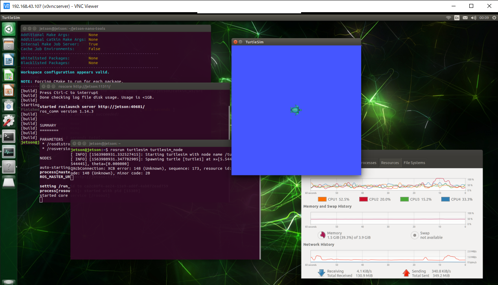

# July 22
Witer : [waarrk](https://twitter.com/waarrk)

## Install ROS on Jetson Nano
ROS stands for [Robot Operating System](http://wiki.ros.org/).  
We will control our robot on this os.  
So I installed ROS.  
### How to
[In this site](https://qiita.com/karaage0703/items/aa54e086f0a2f165d3e9), there is a script that can install ROS semi-automatically.  
If you use that, installation of ROS ends very easily.  
```
git clone https://github.com/karaage0703/jetson-nano-tools
cd jetson-nano-tools
./install-ros-melodic.sh
```
Plese run them.  

## ROS operation check
First, open terminal and run this command.
```
roscore
```
Second, please open terminal in other window and run this command.
```
rosrun turtlesim turtlesim_node
```
If you have successfully installed ROS, you should see a turtle.  

That's all thank you.
