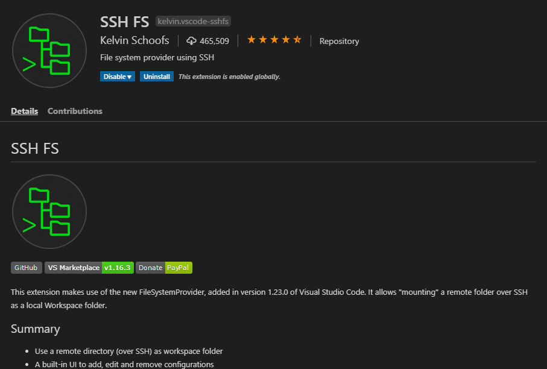
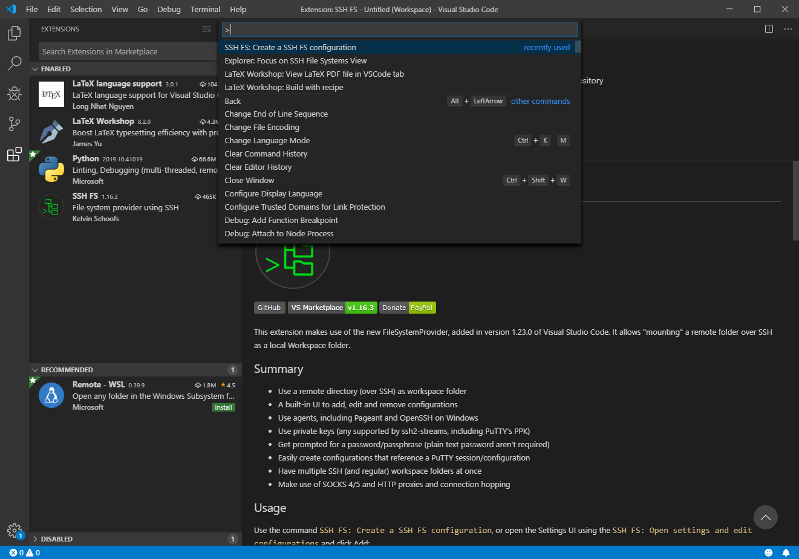
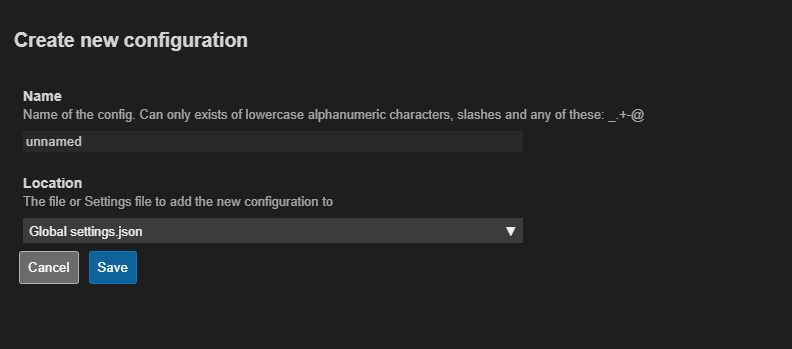
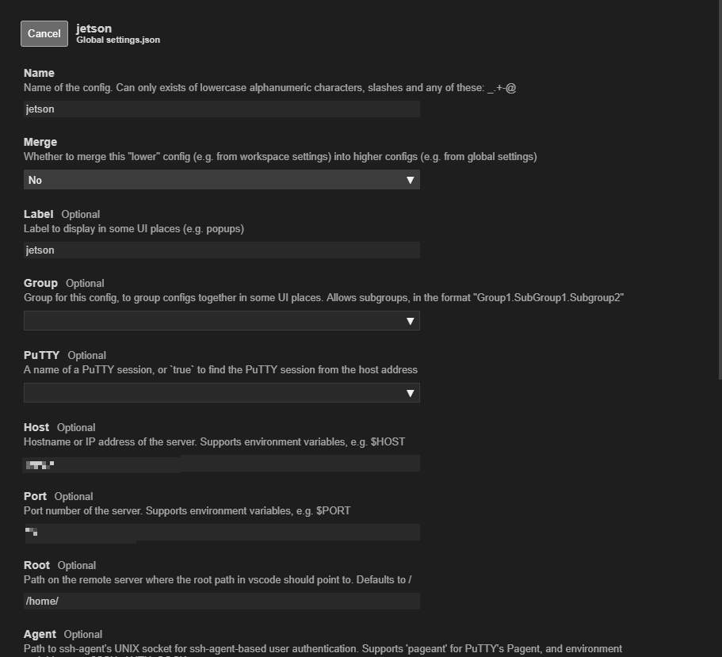
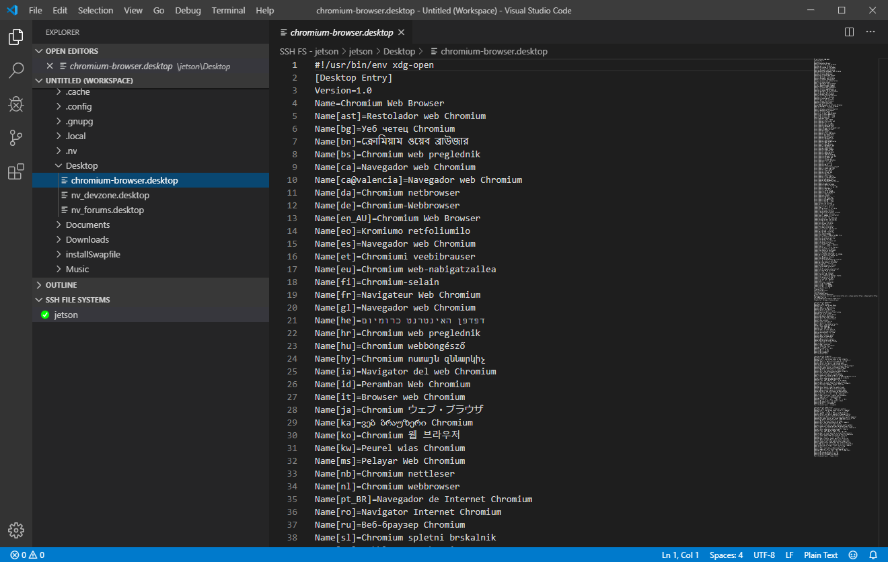

# October 11
Witer : [waarrk](https://twitter.com/waarrk)

## install SSH FS on VScode
[SSH FS](https://marketplace.visualstudio.com/items?itemName=Kelvin.vscode-sshfs) is very useful extention program for VScode.
It can show remote's directory as tree and choise and edit.

### How to
1.Please install SSH FS from marketplase.

2.Please open command pallet. shift+ctrl+p

3.Please choise "Create a SSH FS configration.
4.Please input your remote's name.

5.Please setting.

6.You can connection to remote from "SSH FILE SYSTEM" on exploler of VScode.

That's all thank you.
